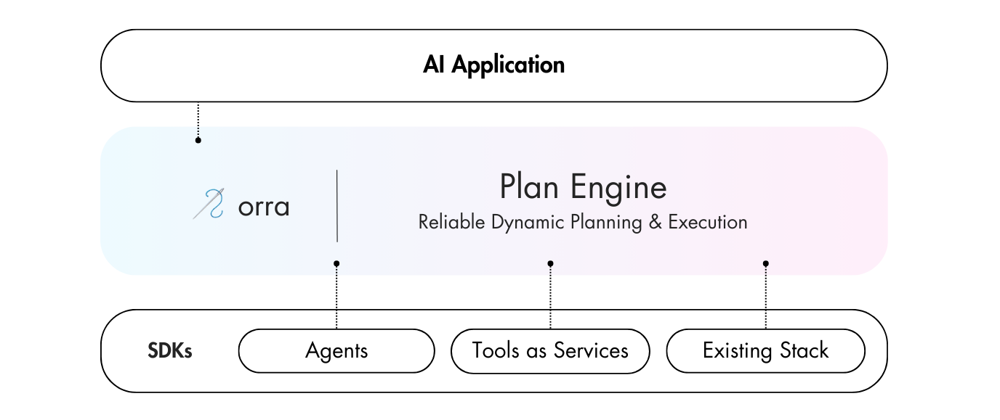

# 🪡 orra

Orra is infrastructure for resilient AI agent workflows. It helps your agents recover from failures like API outages, failed evals, and more - keeping your workflows moving forward.



By intelligently coordinating tasks across your agents, tools, and existing stack, orra ensures robust execution in any environment. It’s designed to work seamlessly with any language, agent framework, or deployment platform.

* 🧠 Planning agent with automatic agent/service discovery
* 🗿 Durable execution with state persistence
* 🎯 Pre-validated execution plans
* ↩️ Revert state to handle failures
* 🕵 Audit logs for traceability
* 🚀 Go fast and save cost with tools as services
* ⛑️ Automatic health monitoring
* 🔮 Real-time status tracking
* 🏢 On-premises deployment
* 🪝 Webhooks notifications for completions and failures

[Learn why we built orra →](https://tinyurl.com/orra-launch-blog-post)

### Coming Soon

* Integration adapters for popular agent frameworks
* Scale your workflows with reliable coverage
* Planning course correction for failed evals
* Agent replay and multi-LLM consensus planning
* End-to-end encryption
* Granular workflow access controls
* Continuous adjustment of Agent workflows during runtime
* Additional language SDKs - Ruby, DotNet and Go very soon!
* MCP integration
* SOC 2 and GDPR readiness to meet the needs of regulated industries

## Table of Contents

- [Installation](#installation)
- [How The Plan Engine Works](#how-the-plan-engine-works)
- [Orra vs Agent Frameworks & Workflow Engines](#orra-vs-agent-frameworks-and-workflow-engines)
- [Orra Plan Engine vs MCP](#orra-plan-engine-vs-mcp)
- [Guides](#guides)
- [Explore Examples](#explore-examples)
- [Docs](#docs)
- [Self Hosting & On-premises Deployment](#self-hosting--on-premises-deployment)
- [Support](#support)
- [Telemetry](#telemetry)
- [License](#license)

## Installation

### Prerequisites

- [Docker](https://docs.docker.com/desktop/) and [Docker Compose](https://docs.docker.com/compose/install/) - For running the Plan Engine
- Set up Reasoning and Embedding Models to power task planning and execution plan caching/validation

#### Setup Models for Plan Engine

Select from a variety of supported models:

**Reasoning Models**:
- OpenAI's `o1-mini` or `o3-mini` on cloud
- `deepseek-r1` or `qwq-32b` on cloud or self-hosted (on-premises or locally)

**Embedding Models**:
- OpenAI's `text-embedding-3-small` on cloud
- `jina-embeddings-v2-small-en` on cloud or self-hosted (on-premises or locally)

> **Note**: The Plan Engine requires all model endpoints to be **OpenAI API-compatible**. Most model serving solutions (like vLLM, LMStudio, Ollama, etc.) can be configured to expose this compatible API format.

**Quick Cloud Setup Example**:

Update the .env based on the [_env](planengine/_env) file with one of these:

```shell
# OpenAI Reasoning
LLM_MODEL=o1-mini
LLM_API_KEY=your_api_key
LLM_API_BASE_URL=https://api.openai.com/v1

# OpenAI Embeddings
EMBEDDINGS_MODEL=text-embedding-3-small
EMBEDDINGS_API_KEY=your_api_key
EMBEDDINGS_API_BASE_URL=https://api.openai.com/v1
```

**Self-hosted/On-premises Example**:

Update the .env based on the [_env](planengine/_env) file with one of these:

```shell
# Self-hosted QwQ model
LLM_MODEL=qwq-32b-q8
LLM_API_KEY=your_internal_key  # Optional depending on your setup
LLM_API_BASE_URL=http://your-internal-server:8000/v1

# Self-hosted Jina embeddings
EMBEDDINGS_MODEL=jina-embeddings-v2-small-en
EMBEDDINGS_API_KEY=your_internal_key  # Optional depending on your setup
EMBEDDINGS_API_BASE_URL=http://your-internal-server:8001/v1
```

→ [Complete Model Configuration Documentation](docs/model-configuration.md)

### 1. Install orra CLI

Download the latest CLI binary for your platform from our [releases page](https://github.com/orra-dev/orra/releases):

```shell
# macOS
curl -L https://github.com/orra-dev/orra/releases/download/v0.2.6/orra-darwin-arm64 -o /usr/local/bin/orra
chmod +x /usr/local/bin/orra

# Linux
curl -L https://github.com/ezodude/orra/releases/download/v0.2.6/orra-linux-amd64 -o /usr/local/bin/orra
chmod +x /usr/local/bin/orra

# Verify installation
orra version
```

→ [Full CLI documentation](docs/cli.md)

### 2. Get orra Plan Engine Running

Clone the repository and start the Plan Engine:

```shell
git clone https://github.com/ezodude/orra.git
cd orra/planengine

# Start the Plan Engine
docker compose up --build
```

## How The Plan Engine Works

The Plan Engine powers your multi-agent applications through intelligent planning and reliable execution:

### Progressive Planning Levels

#### 1. Base Planning

Your agents stay clean and simple (wrapped in the orra SDK):

**Python**
```python
from orra import OrraAgent, Task
from pydantic import BaseModel

class ResearchInput(BaseModel):
    topic: str
    depth: str

class ResearchOutput(BaseModel):
    summary: str

agent = OrraAgent(
    name="research-agent",
    description="Researches topics using web search and knowledge base",
    url="https://api.orra.dev",
    api_key="sk-orra-..."
)

@agent.handler()
async def research(task: Task[ResearchInput]) -> ResearchOutput:
    results = await run_research(task.input.topic, task.input.depth)
    return ResearchOutput(summary=results.summary)
```

**JavaScript**
```javascript
import { initAgent } from '@orra.dev/sdk';

const agent = initAgent({
  name: 'research-agent',
  orraUrl: process.env.ORRA_URL,  
  orraKey: process.env.ORRA_API_KEY
});

await agent.register({
  description: 'Researches topics using web search and knowledge base',
  schema: {
    input: {
      type: 'object',
      properties: {
        topic: { type: 'string' },
        depth: { type: 'string' }
      }
    },
    output: {
      type: 'object',
      properties: {
        summary: { type: 'string' }
      }
    }
  }
});

agent.start(async (task) => {
  const results = await runResearch(task.input.topic, task.input.depth);
  return { summary: results.summary };
});
```

Features:
* AI analyzes intent and creates execution plans that target your components
* Automatic service discovery and coordination
* Parallel execution where possible

#### 2. Production Planning with Domain Grounding

```yaml
# Define domain constraints
name: research-workflow
domain: content-generation
use-cases:
  - action: "Research topic {topic}"
    capabilities: 
      - "Web search access"
      - "Knowledge synthesis"
constraints:
  - "Verify sources before synthesis"
  - "Maximum research time: 10 minutes"
```

Features:
* Full semantic validation of execution plans
* Capability matching and verification
* Safety constraints enforcement
* State transition validation

#### 3. Reliable Execution

```bash
# Execute an action with the Plan Engine
orra verify run "Research and summarize AI trends" \
  --data topic:"AI in 2024" \
  --data depth:"comprehensive"
```

The Plan Engine ensures:
* Automatic service health monitoring
* Stateful execution tracking
* Built-in retries and recovery
* Real-time status updates
* Webhook events for result delivery and monitoring

## Orra vs Agent Frameworks and Workflow Engines

Orra takes a unique approach to AI workflow orchestration. Here's how it compares to other solutions:

|                       | **orra**                                                                                                     | **Agent Frameworks**<br/>(e.g. Mastra, LangGraph)                             | **Workflow Engines**<br/>(e.g. Temporal, Inngest)        |
|-----------------------|--------------------------------------------------------------------------------------------------------------|-------------------------------------------------------------------------------|----------------------------------------------------------|
| **Purpose**           | Multi-agent coordination layer                                                                               | Build individual AI agents                                                    | Run pre-planned workflows                                |
| **Planning Style**    | AI-driven plan generation                                                                                    | Hardcoded agent workflows                                                     | Manual workflow definition                               |
| **Error Recovery**    | Auto-recovery without restart                                                                                | Try/catch manual handling                                                     | Config-based retry policies                              |
| **Best For**          | Complex unpredictable workflows                                                                              | Single agent development                                                      | Repeatable business processes                            |
| **Example Use**       | "Deliver this product by Friday" → dynamically coordinates research, inventory, delivery, and payment agents | "Analyze this document" → fixed steps of reading, extracting, and summarizing | "Process new signup" → predefined steps with retry logic |

Orra is for building AI systems that need to adapt and recover when things go wrong, without brittle scripts or manual fixes.

## Orra Plan Engine vs MCP

| Aspect | Orra Plan Engine                                          | Model Context Protocol (MCP)                         |
|--------|-----------------------------------------------------------|------------------------------------------------------|
| **Purpose** | Orchestrate multi-agent workflows end-to-end              | Connect single LLM to external tools/data            |
| **Best For** | Production multi-agent applications that need reliability | Extending LLM capabilities with APIs and databases   |
| **Planning** | AI dynamically generates execution plans                  | Developer defines available tools                    |
| **Execution** | Stateful workflow coordination with recovery              | Direct tool calls via LLM                            |
| **State Management** | Persistent orchestration state with audit logs            | Stateless request/response                           |
| **Error Handling** | Automatic retries, compensation, and rollback             | Tool returns error to LLM                            |
| **Complexity** | Full workflow orchestration platform                      | Simple integration protocol                          |
| **When to Use** | Building production AI systems with multiple agents       | Building AI assistants, enhancing single agents      |

### Real-World Examples

**Use MCP when:**
- Adding web search to your Claude chatbot
- Connecting an LLM to your company's database
- Building a research assistant that needs multiple data sources

**Use Orra when:**
- Orchestrating fraud detection agent pipelines without writing custom abort/retry logic or state management
- Building incident response agent workflows without implementing failure recovery or escalation infrastructure
- Creating e-commerce agent workflows without building compensation logic or transaction coordination

### Can They Work Together?

Yes! MCP handles the "how do I connect to systems" while orra handles the "how do I coordinate complex workflows." You might use MCP to expose individual agent capabilities, then use Orra to orchestrate those agents in production workflows.

## Guides

- [From Fragile to Production-Ready Multi-Agent App](https://github.com/orra-dev/agent-fragile-to-prod-guide)
- [From Fragile to Production-Ready Multi-Agent App (with Cloudflare Agents)](https://github.com/orra-dev/agent-fragile-to-prod-guide-with-cf-agents)

## Explore Examples

- 🛒 [E-commerce AI Assistant (JavaScript)](examples/ecommerce-agent-app) - E-commerce customer service with a delivery specialized agent
- 👻 [Ghostwriters (Python)](examples/crewai-ghostwriters) - Content generation example showcasing how to use orra with [CrewAI](https://www.crewai.com)
- 📣 [Echo Tools as Service (JavaScript)](examples/echo-js) - Simple example showing core concepts using JS
- 📣 [Echo Tools as Service (Python)](examples/echo-python) - Simple example showing core concepts using Python

## Docs

- [Rapid Multi-Agent App Development with orra](docs/rapid-agent-app-devlopment.md)
- [What is an Agent in orra?](docs/what-is-agent.md)
- [Orchestrating Actions with orra](docs/actions.md)
- [Monitoring with Webhooks](docs/monitoring-with-webhooks.md)
- [Domain Grounding Execution](docs/grounding.md)
- [Execution Plan Caching](docs/plan-caching.md)
- [Core Topics & Internals](docs/core.md)
- [Model Configuration for the orra Plan Engine](docs/model-configuration.md)

## Self Hosting & On-premises Deployment

### Running Plan Engine

The orra Plan Engine is packaged with a [Dockerfile](planengine/Dockerfile) for easy deployment:

- **Local Development**: [Run it as a single instance](#installation) using Docker or Docker Compose
- **On-premises Deployment**: Deploy in your own infrastructure with your preferred orchestration system
- **Cloud Service**: Run on managed container services like [Digital Ocean's App Platform](https://docs.digitalocean.com/products/app-platform/how-to/deploy-from-monorepo/) or any Kubernetes environment

### Using Self-hosted Models (Remote or On-premises)

The Plan Engine fully supports self-hosted open-source models:

- **Reasoning**: Deploy `deepseek-r1` or `qwq-32b` using your preferred model serving solution including on-premises 
- **Embeddings**: Self-host `jina-embeddings-v2-small-en` for complete control

> **Important**: Your model serving solution must expose an **OpenAI-compatible API**. Solutions like vLLM, LMStudio, Ollama with OpenAI compatibility mode, or Replicate all work great.

→ [Complete Model Configuration Guide](docs/model-configuration.md)

### Data Storage

The Plan Engine uses [BadgerDB](https://github.com/hypermodeinc/badger) embedded database to persist all state - operational information is queryable using the [orra CLI](docs/cli.md).

[Book an office hours slot](https://cal.com/orra-dev/office-hours) to get help hosting or running orra's Plan Engine for production.

## Support

Need help? We're here to support you:

- Report a bug or request a feature by creating an [issue](https://github.com/orra-dev/orra/issues/new?template=bug-report-feature-request.yml)
- Start a [discussion](https://github.com/orra-dev/orra/discussions) about your ideas or questions

## Telemetry

See [telemetry.md](./docs/telemetry.md) for details on what is collected and how to opt out.

## License

Orra is MPL-2.0 licensed.
