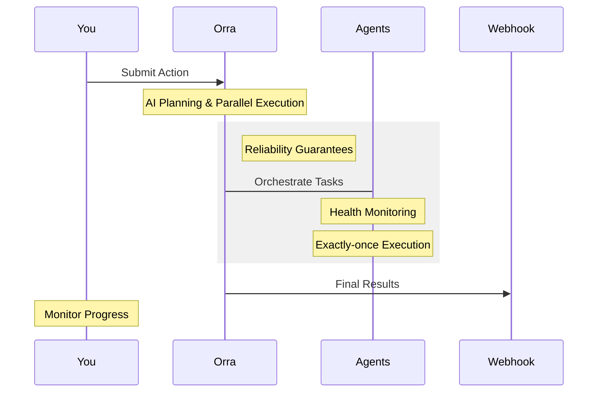

# Orchestrating Actions with Orra

## Understanding Actions

Actions are high-level instructions that Orra's Plan Engine decomposes into tasks that execute against selected services, tools as services and agents to complete a job. Think of actions as user/machine jobs that need to be fulfilled by your system.

## Submitting Actions

There are two main ways to submit actions:

### 1. Using the CLI (for testing and development)

```bash
# Basic action
orra verify run "reconcile last nights invoices"

# Action with multiple parameters
orra verify run "Estimate order delivery and notify customer" \
  -d orderId:ORD456 \
  -d customerId:ABC123

# Specify webhook for results (assumes the Plane Engine is running with docker compose)
orra verify run "Process refund request ensuring it is not fraudulent" \
  -w http://host.docker.internal:3000/webhooks/results \ 
  -d orderId:ORD789
```

See [docs/cli.md](cli.md) for detailed CLI usage.

### 2. Using the HTTP API (for production)

```bash
curl -X POST http://localhost:8005/orchestrations \
  -H "Authorization: Bearer your-api-key" \
  -H "Content-Type: application/json" \
  -d '{
    "action": {
      "content": "Process order payment and update inventory"
    },
    "data": [
      {"field": "orderId", "value": "ORD123"},
      {"field": "amount", "value": "299.99"},
      {"field": "productId", "value": "PROD456"}
    ],
    "webhook": "https://your-app.com/webhooks/orra"
  }'
```

# Working with Orra Actions

As an AI Engineer, you know the challenges of building reliable multi-agent systems - agents failing silently, lost messages, and no visibility into what's happening. Actions are how Orra solves these problems.

## How Actions Work

An action is your high-level intent (e.g., "Help customer ABC123 with their order"). Orra handles the complexity of reliable execution:



### 1. Submit Actions

```bash
# Direct intent, Orra handles the complexity
orra verify run "Help customer with delayed order" \
  -d customerId:CUST789 \
  -d orderId:ORD456
```

### 2. Monitor Progress

```bash
# Real-time visibility
orra inspect ORD456

┌─ Tasks
│ ✓ Customer history retrieved
│ ✓ Order details fetched
│ ◐ Generating response
```

### 3. Get Results

```javascript
// Your webhook receives definitive results
app.post('/webhooks/orra', (req, res) => {
  const { orchestrationId, status, results } = req.body;
  // Handle results confidently
  res.sendStatus(200);
});
```

Want more details?
- [Core Topics & Internals →](../docs/core)

## Monitoring Actions

Track action progress using the CLI:

```bash
# List all actions
orra ps

# Get detailed status of specific action
orra inspect <action-id>

# Get detailed execution information
orra inspect -d <action-id>
```

## Handling Results

Configure a webhook endpoint to receive action results:

```javascript
// Example Express webhook handler
app.post('/webhooks/orra', (req, res) => {
  const {
    orchestrationId,
    status,
    results,
    error
  } = req.body;

  if (status === 'completed') {
    // Handle successful completion
    processResults(results);
  } else if (status === 'failed') {
    // Handle failure
    handleError(error);
  }

  res.sendStatus(200);
});
```

## Best Practices

1. **Action Design**
    - Make actions clear and specific
    - Include all necessary parameters
    - Use consistent parameter naming

2. **Parameter Handling**
    - Validate parameters before submission
    - Use appropriate data types
    - Include required context

3. **Webhook Implementation**
    - Implement idempotent webhook handlers
    - Add authentication to webhook endpoints
    - Handle all possible status codes

4. **Monitoring**
    - Regularly check action status
    - Set up alerts for failed actions
    - Monitor action completion times

## Example: E-commerce Order Processing

```bash
# Submit order processing action
orra verify run "Process new order and arrange optimal delivery" \
  -d orderId:ORD123 \
  -d customerId:CUST456 \
  -d items:[{"id":"PROD789","quantity":2}] \
  -w http://host.docker.internal:3000/webhooks/order-processing

# Monitor progress
orra inspect o_fdhdhjhashah

# Webhook receives final result
{
  "orchestrationId": "o_fdhdhjhashah",
  "status": "completed",
  "results": {
    "orderStatus": "processed",
    "paymentStatus": "confirmed",
    "deliveryTracking": "DLV987",
    "estimatedDelivery": "2024-11-10"
  }
}
```

This orchestration might involve multiple services, tools as services and agents:
- Payment processing service
- Inventory management tool as a service
- Delivery scheduling agent
- Customer notification tool as a service

Orra handles the complexity of coordinating these components while you focus on implementing their core logic.
