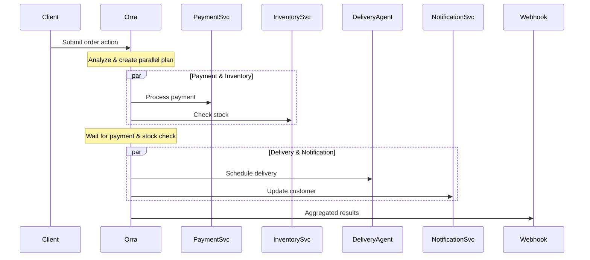

# Orchestrating Actions with Orra

## Understanding Actions

Actions are high-level instructions that Orra's control plane decomposes into orchestrated tasks across your services and agents. Think of actions as user intents that need to be fulfilled by your system.

## Submitting Actions

There are two main ways to submit actions:

### 1. Using the CLI (for testing and development)

```bash
# Basic action
orra verify run "reconcile last nights invoices"

# Action with multiple parameters
orra verify run "Estimate order delivery and notify customer" \
  -d orderId:ORD456 \
  -d customerId:ABC123

# Specify webhook for results
orra verify run "Process refund request ensuring it is not fraudulent" \
  -w http://localhost:3000/webhooks/results \
  -d orderId:ORD789
```

### 2. Using the HTTP API (for production)

```bash
curl -X POST http://localhost:8005/orchestrations \
  -H "Authorization: Bearer your-api-key" \
  -H "Content-Type: application/json" \
  -d '{
    "action": {
      "content": "Process order payment and update inventory"
    },
    "data": [
      {"field": "orderId", "value": "ORD123"},
      {"field": "amount", "value": "299.99"},
      {"field": "productId", "value": "PROD456"}
    ],
    "webhook": "https://your-app.com/webhooks/orra"
  }'
```

## How Actions Work

1. **Submission**: Action is submitted with parameters
2. **Analysis**: Control plane uses AI to analyze the action
3. **Planning**: Creates a parallel execution plan using available services/agents
4. **Orchestration**: Executes tasks across services with maximum parallelization
5. **Results**: Aggregates results and delivers via webhook

### Parallel Execution

Orra maximizes performance by running independent tasks in parallel. The control plane:

1. Analyzes task dependencies
2. Creates parallel execution groups
3. Runs independent groups simultaneously
4. Manages data flow between dependent tasks

Example parallel execution:


In this example:
- Payment processing and inventory checks run in parallel
- Once both complete, delivery and notification run in parallel
- Orra handles all coordination and data flow between tasks

### Example CLI Output

```bash
$ orra inspect -d order123

┌─ Orchestration Details
│ ID: order123
│ Status: completed
│ Action: Process order and arrange delivery
│ Created: 2m ago

┌─ Tasks
│ ID       SERVICE          STATUS       DURATION
│ payment  PaymentSvc      completed    1.2s
│ stock    InventorySvc    completed    1.1s      # Ran parallel with payment
│ delivery DeliveryAgent   completed    2.3s      # Started after payment & stock
│ notify   NotifySvc       completed    0.8s      # Ran parallel with delivery
```

### Parallel Groups in Action Response

When you create an action, the response includes the parallel execution plan:

```json
{
  "tasks": [
    {"id": "payment", "service": "PaymentService", "input": {...}},
    {"id": "inventory", "service": "InventoryService", "input": {...}},
    {"id": "delivery", "service": "DeliveryAgent", "input": {...}},
    {"id": "notify", "service": "NotificationService", "input": {...}}
  ],
  "parallel_groups": [
    ["payment", "inventory"],   // These run in parallel
    ["delivery", "notify"]      // These run in parallel after first group
  ]
}
```

Orra's parallel execution ensures:
- Maximum throughput by running independent tasks simultaneously
- Correct ordering of dependent tasks
- Efficient resource utilization
- Minimal end-to-end execution time

Would you like me to expand further on any aspect of the parallel execution system?

## Monitoring Actions

Track action progress using the CLI:

```bash
# List all actions
orra ps

# Get detailed status of specific action
orra inspect <action-id>

# Get detailed execution information
orra inspect -d <action-id>
```

## Handling Results

Configure a webhook endpoint to receive action results:

```javascript
// Example Express webhook handler
app.post('/webhooks/orra', (req, res) => {
  const {
    orchestrationId,
    status,
    results,
    error
  } = req.body;

  if (status === 'completed') {
    // Handle successful completion
    processResults(results);
  } else if (status === 'failed') {
    // Handle failure
    handleError(error);
  }

  res.sendStatus(200);
});
```

## Best Practices

1. **Action Design**
    - Make actions clear and specific
    - Include all necessary parameters
    - Use consistent parameter naming

2. **Parameter Handling**
    - Validate parameters before submission
    - Use appropriate data types
    - Include required context

3. **Webhook Implementation**
    - Implement idempotent webhook handlers
    - Add authentication to webhook endpoints
    - Handle all possible status codes

4. **Monitoring**
    - Regularly check action status
    - Set up alerts for failed actions
    - Monitor action completion times

## Example: E-commerce Order Processing

```bash
# Submit order processing action
orra verify run "Process new order and arrange optimal delivery" \
  -d orderId:ORD123 \
  -d customerId:CUST456 \
  -d items:[{"id":"PROD789","quantity":2}] \
  -w http://localhost:3000/webhooks/order-processing

# Monitor progress
orra inspect o_fdhdhjhashah

# Webhook receives final result
{
  "orchestrationId": "o_fdhdhjhashah",
  "status": "completed",
  "results": {
    "orderStatus": "processed",
    "paymentStatus": "confirmed",
    "deliveryTracking": "DLV987",
    "estimatedDelivery": "2024-11-10"
  }
}
```

This orchestration might involve multiple services:
- Payment processing service
- Inventory management service
- Delivery scheduling agent
- Customer notification service

Orra handles the complexity of coordinating these services while you focus on implementing their core logic.
