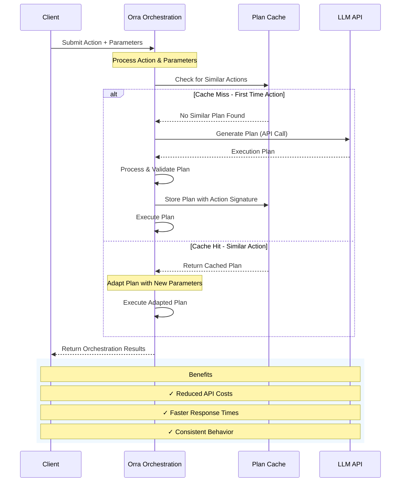

# Plan Caching in Orra

One of Orra's most powerful features is its ability to intelligently cache execution plans, significantly reducing API costs while ensuring reliable orchestration of your multi-agent applications. This document explains how plan caching works and how it helps optimize your LLM usage.

## Overview

When you submit an action to Orra (e.g., "Process order #12345"), the system needs to generate an execution plan to coordinate the different services required for this action. This plan generation typically involves an LLM (Large Language Model) call, which incurs costs.

Orra's plan caching system intelligently detects similar actions and reuses previously generated execution plans when appropriate, saving both time and API costs.

## How Plan Caching Works

### 1. Vector-Based Similarity Matching

Orra uses vector embeddings to determine when actions are semantically similar:

1. **Action Vectorization**: Each action's text and parameter field names are converted into embeddings using an embedding model.
2. **Service State Hashing**: A hash is generated based on the available services and their capabilities.
3. **Similarity Computation**: When a new action arrives, Orra computes its similarity to previously cached actions using cosine similarity.
4. **Cache Hit Detection**: If an action is sufficiently similar to a cached one (>0.95 similarity), the cached plan is used.

### 2. Dynamic Parameter Substitution

Orra doesn't just cache static plans—it intelligently adapts them to new inputs:

1. **Parameter Mapping**: When caching a plan, Orra identifies which input fields in Task 0 correspond to specific action parameters.
2. **Value Substitution**: For cache hits, the system updates the cached plan with the new parameter values.
3. **Task Input Propagation**: These updated values flow through to dependent tasks, ensuring the entire plan works with the new parameters.

### 3. Cache Management

The caching system includes several key features for efficient management:

1. **Project-Specific Caches**: Each project has its own cache to ensure isolation.
2. **Time-Based Expiration**: Cached plans expire after a configurable TTL (Time To Live).
3. **Size-Limited Cache**: The cache has a maximum size per project to prevent memory issues.
4. **Automatic Cleanup**: A background process periodically removes expired entries.

## Sequence Diagram: Plan Caching Workflow

The following diagram illustrates the key aspects of how plan caching works in Orra:

## Cost Savings with Plan Caching

### LLM Cost Reduction

Plan caching significantly reduces the number of LLM API calls needed for repetitive or similar actions:

- **First Action**: Uses the LLM to generate a plan (incurs API cost).
- **Similar Actions**: Use the cached plan with substituted parameters (no LLM API cost).

For example, if your application frequently processes orders with varying order IDs, only the first "Process order" action requires an LLM call. Subsequent similar actions reuse the cached plan with different order IDs substituted in.

### Real-World Savings Scenarios

1. **High-Volume Transactions**:
   - Without caching: 1,000 similar actions = 1,000 LLM calls
   - With caching: 1,000 similar actions = 1 LLM call + 999 cache hits

2. **Repeated Patterns**:
   - Customers asking similar questions with different specifics
   - Regular operations with different parameters (e.g., "Check inventory for Product X")

3. **Batch Processing**:
   - When processing lists of items with the same action pattern

## Grounding and Caching Integration

Orra's groundings feature works seamlessly with the caching system to provide even more benefits:

### How Grounding Affects Caching

1. **Cache Partitioning**: Plans with groundings are cached separately from non-grounded plans.
2. **Domain-Specific Caching**: Similar actions within the same grounding domain benefit from caching.
3. **Validation Optimization**: Cached plans from the same grounding have already passed domain-specific validations.

### Grounding Cache Benefits

1. **Reduced Validation Overhead**: For cached plans with grounding, Orra can skip expensive PDDL validation steps.
2. **Domain-Optimized Plans**: Cached plans already incorporate domain-specific knowledge and constraints.
3. **Consistent Behavior**: Ensures actions in the same domain are handled consistently.

## Best Practices for Maximizing Cache Efficiency

To get the most benefit from Orra's plan caching:

1. **Consistent Action Phrasing**: Use consistent language for similar actions.
   - Good: "Process order #123" → "Process order #456"
   - Poor: "Process order #123" → "Handle order number 456"

2. **Standard Parameter Structure**: Keep parameter field names consistent across similar actions.
   - Good: `orderId: "123"` → `orderId: "456"`
   - Poor: `orderId: "123"` → `order_number: "456"`

3. **Service Stability**: Avoid frequently changing service descriptions or capabilities, as this invalidates the cache.

4. **Domain Grounding**: Use grounding for domain-specific actions to benefit from both domain knowledge and caching.

## Monitoring Cache Performance

You can monitor cache performance through:

1. **Orchestration Logs**: Cache hits and misses are logged at the trace level.
2. **Plan Engine Metrics**: The cache hit rate is available in monitoring dashboards.
3. **API Cost Analysis**: Compare API usage before and after implementing consistent action patterns.

## Cache Configuration Parameters

Orra's caching system operates within these parameters:

| Parameter | Description | Value    |
|-----------|-------------|----------|
| `CACHE_TTL` | Time to live for cached plans | 24 hours |
| `CACHE_MAX_SIZE` | Maximum number of plans to cache per project | 100      |
| `CACHE_SIMILARITY_THRESHOLD` | Minimum similarity score for a cache hit | 0.95     |

## Conclusion

Orra's plan caching system significantly reduces LLM API costs by intelligently reusing execution plans for similar actions. By combining vector similarity matching with dynamic parameter substitution, Orra provides both cost savings and consistent orchestration behavior.

When used in conjunction with domain grounding, the caching system becomes even more powerful, ensuring that domain-specific knowledge is applied consistently while still minimizing API calls.

By following the best practices outlined in this document, you can maximize the efficiency of your Orra implementation and minimize your operational costs.
