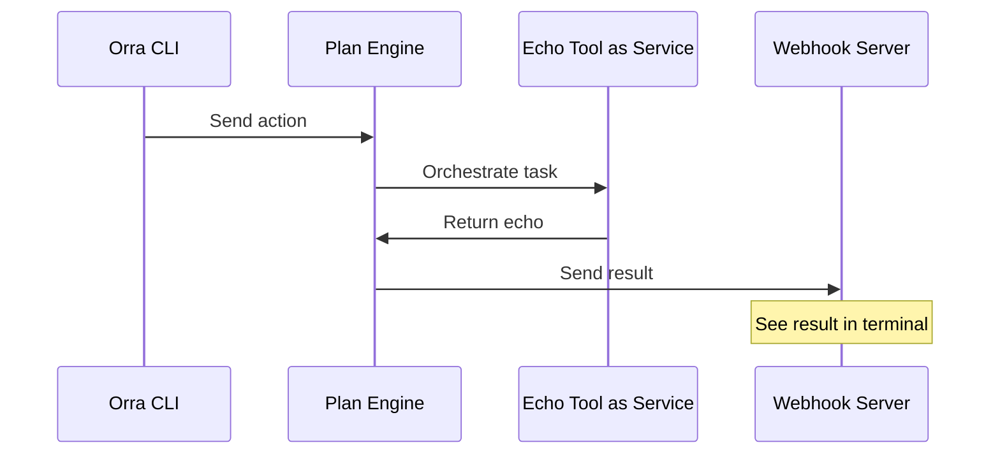

# Echo Service Example (JavaScript)

A minimal example demonstrating how to build and coordinate a tool as a service using Orra's Plan Engine. It's Orra Hello World!



## ✨ Features

- 🔄 Basic service registration and coordination
- 📡 Real-time WebSocket communication
- ⚡ Reliable message delivery
- 🛡️ Built-in health monitoring
- 🚀 Simple but production-ready patterns

## Prerequisites

- [Docker](https://docs.docker.com/get-docker/) and [Docker Compose](https://docs.docker.com/compose/install/)
- [OpenAI API key](https://platform.openai.com/api-keys) for Orra's Plan Engine `PLAN_CACHE_OPENAI_API_KEY`
- [OpenAI API key](https://platform.openai.com/api-keys) or [Groq API key](https://console.groq.com/docs/quickstart) for Orra's Plan Engine reasoning models config
- [OpenAI API key](https://platform.openai.com/api-keys) for the `writer_crew` and `editor` Agents


## Setup

1. First, setup Orra and the CLI by following the [installation instructions](../../README.md#installation):

2. Setup your Orra project:
```bash
# Create project, add a webhook and API key
orra projects add my-echo-app
orra webhooks add http://host.docker.internal:8888/webhook
orra api-keys gen echo-key
```

3. Configure the Echo service:
```bash
cd examples/echo
echo "ORRA_API_KEY=echo-key-from-step-2" > .env
```

## Running the Example

1. Start the webhook server (in a separate terminal):
```bash
# Start the webhook server using the verify subcommand
orra verify webhooks start http://localhost:8888/webhook
```

2. Start the Echo service:
```bash
# Start Echo Service
docker compose up
```

3. Try it out:
```bash
# Send a test message
orra verify run "Echo this message" --data message:"Hello from Orra!"

# Check the result
orra ps
orra inspect <orchestration-id>
```

You should see the result both in the webhook server terminal and through the inspect command.

## SDK Integration Example
Here's the complete Echo service implementation showing how simple Orra integration can be:

```javascript
import { initService } from '@orra.dev/sdk';
import schema from './schema.json' assert { type: 'json' };

const echoToolSvc = initService({
	name: 'echo',
	orraUrl: process.env.ORRA_URL,
	orraKey: process.env.ORRA_API_KEY
});

// Health check
app.get('/health', (req, res) => {
	res.status(200).json({ status: 'healthy' });
});

async function startService() {
	try {
		// Register the echo service with Orra
		await echoToolSvc.register({
			description: 'A simple service that echoes back the first input value it receives.',
			schema
		});
			
		echoToolSvc.start(async (task) => {
            console.log('Echoing input:', task.id);
            const { message } = task?.input;
            return { echo: `Echo: ${message}` };
		});
	} catch (error) {
		console.error('Failed to start:', error);
		process.exit(1);
	}
}

// Start the Express server and the service
app.listen(port, () => {
	console.log(`Server listening on port ${port}`);
	startService().catch(console.error);
});
```

In this! Orra provides:
- Service discovery
- Health monitoring
- Reliable task execution
- Error recovery

## Learn More

- [Orra Documentation](../../docs)
- [CLI Documentation](../../docs/cli.md)
