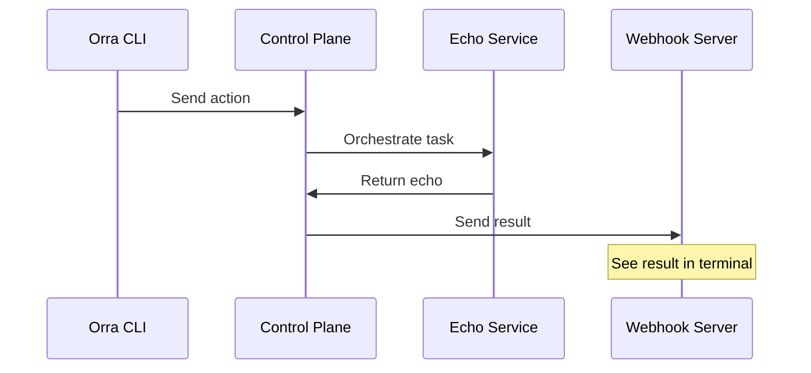

# Echo Service Example (Python)

A minimal example demonstrating how to build and orchestrate a service using Orra's Python SDK.



## Prerequisites

- [Docker](https://docs.docker.com/get-docker/) and [Docker Compose](https://docs.docker.com/compose/install/)
- [Poetry](https://python-poetry.org/docs/#installation)
- [OpenAI API key](https://platform.openai.com/api-keys) for Orra's control plane

## Setup

1. First, setup Orra by following the [Quick Start](../../README.md#quick-start) guide:
```bash
# Clone Orra
git clone https://github.com/ezodude/orra
cd orra/controlplane

# Set your OpenAI API key
echo "OPENAI_API_KEY=your-key-here" > .env

# Start the control plane
docker compose up
```

2. Setup your Orra project:
```bash
# Install Orra CLI 
curl -L https://github.com/ezodude/orra/releases/download/v0.2.1/orra-darwin-arm64 -o /usr/local/bin/orra
chmod +x /usr/local/bin/orra

# Create project, add a webhook and API key
orra projects add my-echo-app
orra webhooks add http://host.docker.internal:8888/webhook
orra api-keys gen echo-key
```

3. Configure the Echo service:
```bash
cd examples/echo-python
echo "ORRA_API_KEY=key-from-step-2" > .env
```

## Running the Example

1. Start the webhook server (in a separate terminal):
```bash
# Start the webhook server using the verify subcommand
orra verify webhooks start http://localhost:8888/webhook
```

2. Start and register the Echo service:
```bash
# With Docker
docker compose up --build

# Or locally with Poetry
poetry install
poetry run python src/main.py
```

3. Try it out:
```bash
# Send a test message
orra verify run 'Echo this message' --data message:'Hello from Orra!'

# Check the result
orra ps
orra inspect <orchestration-id>
```

You should see the result both in the webhook server terminal and through the inspect command.

```bash
# This curl command is equivalent to orra verify run performs internally  
## Send an echo orchestration request to the control plane

curl -X POST http://localhost:8005/orchestrations \
  -H "Authorization: Bearer $ORRA_API_KEY" \
  -H "Content-Type: application/json" \
  -d '{
    "action": {
      "type": "echo",
      "content": "Echo this message"
    },
    "data": [
      {
        "field": "message",
        "value": "Hello from curl!"
      }
    ],
    "webhook": "http://host.docker.internal:8888/api/webhook"
  }'
```

## SDK Integration Example

The core Echo service implementation is straightforward:

```python
from orra import OrraService, Task
from pydantic import BaseModel

class EchoInput(BaseModel):
    message: str

class EchoOutput(BaseModel):
    echo: str

service = OrraService(
    name="echo-service",
    description="A simple echo service",
    url=os.getenv("ORRA_URL"),
    api_key=os.getenv("ORRA_API_KEY")
)

@service.handler()
async def handle_echo(task: Task[EchoInput]) -> EchoOutput:
    return EchoOutput(echo=task.input.message)
```

That's it! Orra provides:
- Service discovery
- Health monitoring
- Reliable task execution
- Error recovery

## Learn More

- [Orra Documentation](../../docs)
- [CLI Documentation](../../docs/cli.md)
