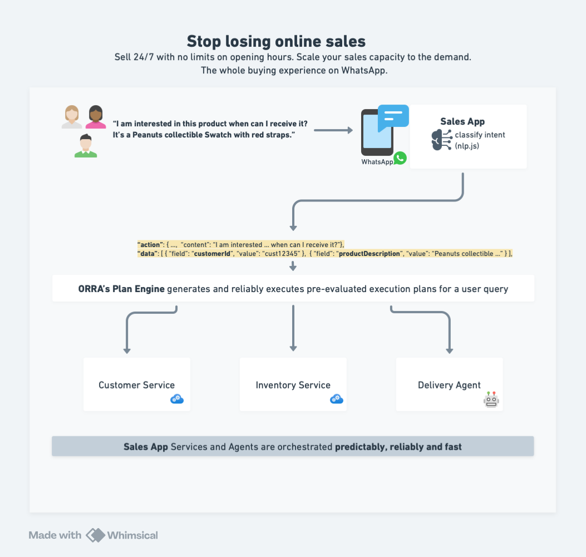

# AI E-commerce Assistant Example

This example demonstrates how to build an AI-powered e-commerce assistant using Orra for reliable multi-agent orchestration.

It uses a chat UI to simulate a WhatsApp sales experience.



## ✨ Features

- 🤖 AI-powered delivery estimates using Mistral's function calling
- 🏪 Real-time product availability checks
- 👤 Customer profile integration
- 📱 Real-time chat UI (simulating WhatsApp)
- ⚡ Parallel service orchestration
- 🔄 Real-time status updates
- 🛡️ Error handling and recovery

## Prerequisites

- [Docker](https://docs.docker.com/get-docker/) and [Docker Compose](https://docs.docker.com/compose/install/)
- [Mistral API key](https://mistral.ai/api/) for the Delivery Agent
- [OpenAI API key](https://platform.openai.com/api-keys) for Orra's control plane

## Setup

1. First, setup Orra by following the [Quick Start](../../README.md#quick-start) guide:
```bash
# Clone Orra
git clone https://github.com/ezodude/orra
cd orra/controlplane

# Set your OpenAI API key
echo "OPENAI_API_KEY=your-key-here" > .env

# Start the control plane
docker compose up
```

2. Setup your Orra project:
```bash
# Install Orra CLI 
curl -L https://github.com/ezodude/orra/releases/download/v0.1.1-narwhal/orra-darwin-arm64 -o /usr/local/bin/orra
chmod +x /usr/local/bin/orra

# Create project and configure a webhook
orra projects add my-ai-app
orra webhooks add http://host.docker.internal:3000/api/webhook
orra api-keys gen production-key
```

3. Configure the example's components:
```bash
cd examples/ecommerce-agent-app/chat-ui
# Create .env file with your keys for
echo "ORRA_API_KEY=key-from-step-2" > .env

cd ../customer-svc
# Create .env file with your keys for
echo "ORRA_API_KEY=key-from-step-2" > .env

cd ../inventory-svc
# Create .env file with your keys for
echo "ORRA_API_KEY=key-from-step-2" > .env

cd ../delivery-agent
# Create .env file with your keys for
echo "ORRA_API_KEY=key-from-step-2" > .env
echo "MISTRAL_API_KEY=your-mistral-key" >> .env
```

## Running the Example

Start each service (in separate terminals):
```bash
# Start Chat UI
cd chat-app
docker compose up

# Start Customer Service
cd customer-svc
docker compose up

# Start Inventory Service
cd inventory-svc
docker compose up

# Start Delivery Agent
cd delivery-agent
docker compose up
```

Visit http://localhost:3000 and try:
```
I am interested in this product when can I receive it? Peanuts collectible Swatch with red straps.
```

## Monitor Orchestrations

```bash
# List active orchestrations
orra ps

# Inspect specific orchestration
orra inspect <orchestration-id>
```

## SDK Integration Example
Here's how easy it is to integrate Orra into your services and agents. The Delivery Agent shows this integration in just a few lines:

```javascript
// Initialize your Agent with environment-aware persistence
const deliveryAgent = initAgent({
	name: 'delivery-agent',
	orraUrl: process.env.ORRA_URL,
	orraKey: process.env.ORRA_API_KEY,
	persistenceOpts: getPersistenceConfig()
});

// Health check
app.get('/health', (req, res) => {
	res.status(200).json({ status: 'healthy' });
});

async function startAgent() {
	try {
		// Register the delivery agent with Orra
		await deliveryAgent.register({
			description: 'An agent that helps customers with intelligent delivery estimation dates and routing for online shopping.',
			schema
		});
		
		// Start handling delivery estimation tasks
		deliveryAgent.start(async (task) => {
			console.log('Processing delivery estimation:', task.id);
			return { response: await estimateDelivery(task.input) };
		});
		
		console.log('Delivery Agent started successfully');
	} catch (error) {
		console.error('Failed to start Delivery Agent:', error);
		process.exit(1);
	}
}

// Start the Express server and the service
app.listen(port, () => {
	console.log(`Server listening on port ${port}`);
	startAgent().catch(console.error);
});

// Graceful shutdown
process.on('SIGTERM', async () => {
	console.log('SIGTERM received, shutting down gracefully');
	deliveryAgent.shutdown();
	process.exit(0);
});
```

That's it! Orra handles the rest:

- Service discovery
- Health monitoring
- Reliable task execution
- Error recovery
- Parallel orchestration

## Architecture

The example consists of:
- **Chat UI**: Next.js frontend simulating WhatsApp
- **Customer Service**: Handles customer data
- **Inventory Service**: Manages product availability
- **Delivery Agent**: Uses Mistral AI for delivery estimations
- **Orra Control Plane**: Orchestrates everything reliably

## Learn More

- [Orra Documentation](../../docs)
- [Reset Guide](../../docs/reset-control-plane.md) (if restarting)
- [CLI Documentation](../../docs/cli.md)
